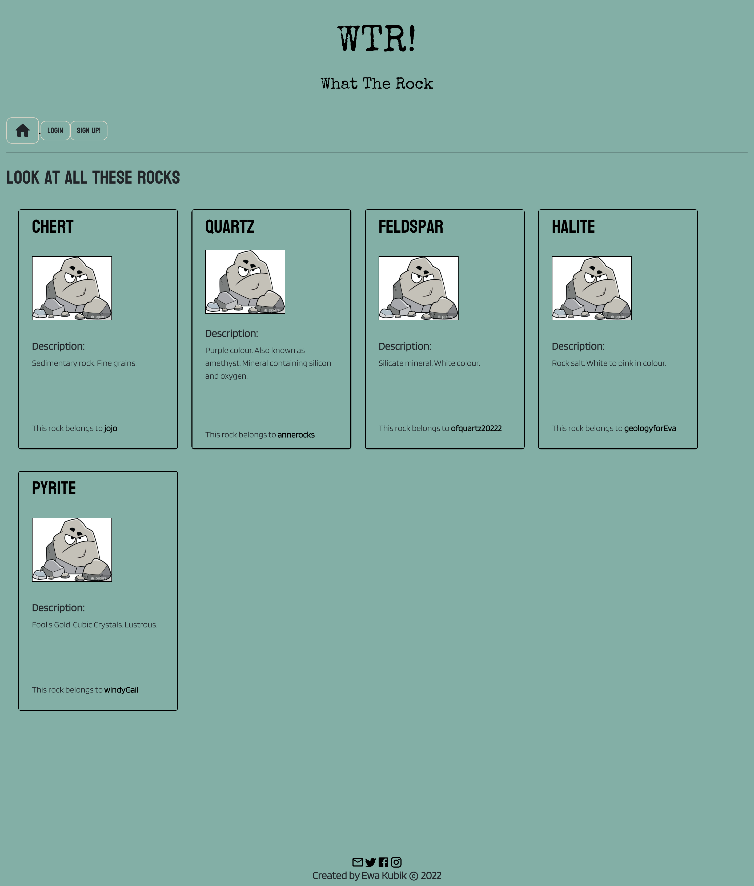
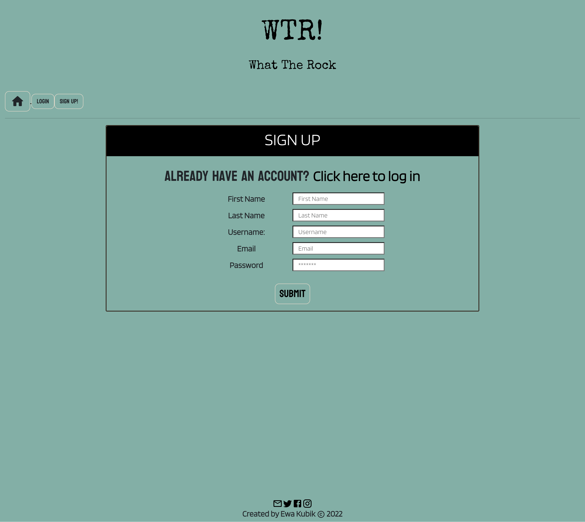

# What the Rock?

## Table of Contents

- <a href="#description">Project Description</a>
- <a href="#technologies">Technologies</a>
- <a href="#demonstration">Demonstration </a>
- <a href="#link">Link </a>
- <a href="#contact">Contact</a>

 

## Description

This is a social networking and cataloguing app for your local rock enthusiast. Users can sign up to store a record of their rock and mineral collections, and to interact with others through with similar interests. 

When using 'What the rock', users can:

* Sign up for an account
* View rocks (all in database, or single specimens)
* View users and their rock collections
* View comments on specific rocks

When logged in, a user can access additional functions, such as:
* Adding and deleting rocks from their own collection
* Leaving comments - a user may try to help another user identify their particular specimen, or they may simply leave a comment to show their appreciation

 

## Technologies

This application was built with:

* GraphQL
* Node.js
* Express.js
* Mongoose
* MongoDB
* React
* Bootstrap
* bcryp
* JSON Web token
* Material UI
* Apollo Express
* Apollo Client

 

 

## Demonstration

 

## Link

To view the deployed application, click <a href="https://tranquil-anchorage-44103.herokuapp.com/"> here </a>

The project repository can be accessed at <a href="https://github.com/ekubik/what-the-rock">https://github.com/ekubik/what-the-rock</a>

 

## Contact

Contact Ewa at <a href="mailto:ewa.kubik@hotmail.com"> ewa.kubik@hotmail.com </a>